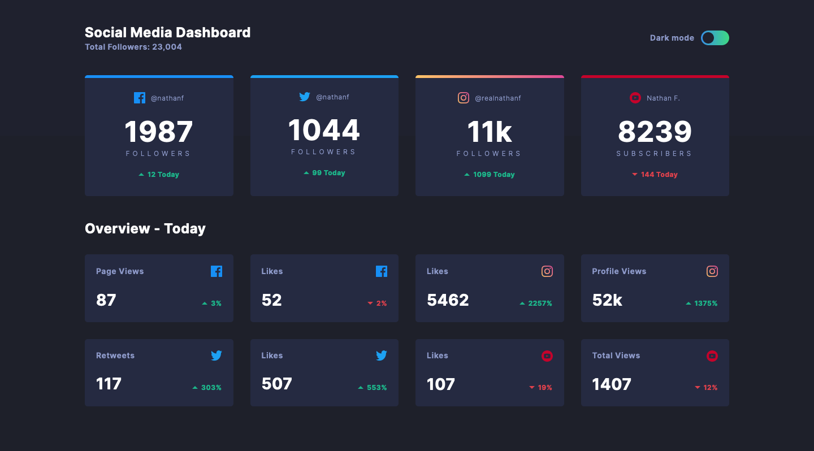
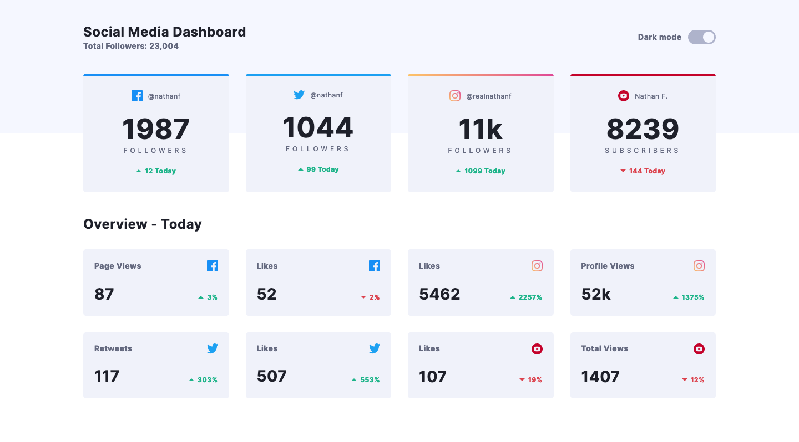
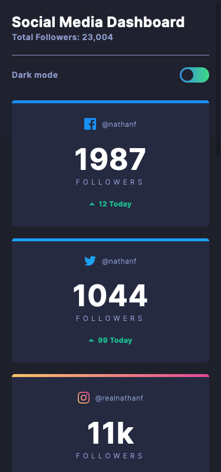
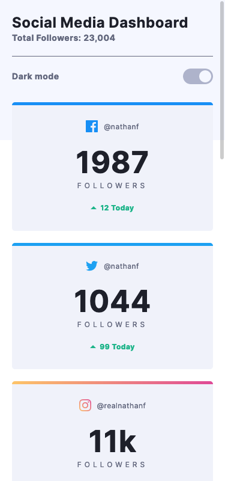

# Frontend Mentor - Social media dashboard with theme switcher

### Design Preview

This is a solution to the [Social media dashboard with theme switcher challenge on Frontend Mentor](https://www.frontendmentor.io/challenges/social-media-dashboard-with-theme-switcher-6oY8ozp_H). Frontend Mentor challenges help you improve your coding skills by building realistic projects. 

## Table of contents

- [Overview](#overview)
  - [The challenge](#the-challenge)
  - [Screenshot](#screenshot)
  - [Links](#links)
- [My process](#my-process)
  - [Built with](#built-with)
  - [What I learned](#what-i-learned)
  - [Author](#author)

## Overview

### The challenge

- Build out the project to the designs provided

### Screenshot
#### Desktop
| Dark     | Light     |
|------------|-------------|
|  |  |
#### Mobile
| Dark     | Light     |
|------------|-------------|
|  |  |

### Links

- Solution URL: [https://github.com/sjneri/socialmedia-dashboard](https://github.com/sjneri/socialmedia-dashboard)
- Live Site URL: [https://sjneri.github.io/socialmedia-dashboard/](https://sjneri.github.io/socialmedia-dashboard/)

## My process

### Built with

- Semantic HTML5 markup
- CSS custom properties
- Flexbox
- jQuery

### What I learned

- Native CSS Variables
- Custom Switch using Checkbox

## Author
Stephen John Neri
- [Github](https://github.com/sjneri)
- [LinkedIn](https://www.linkedin.com/in/stephenjohnneri/)